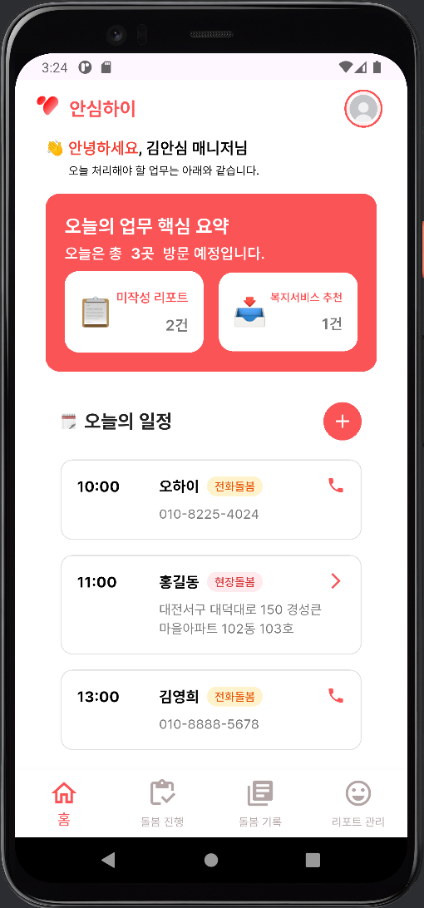
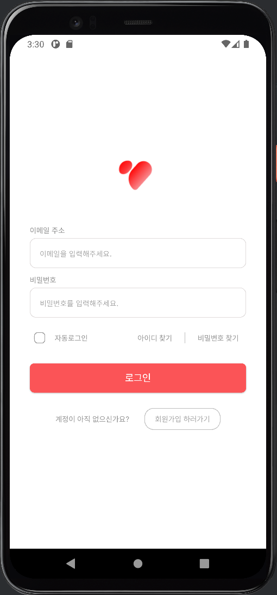
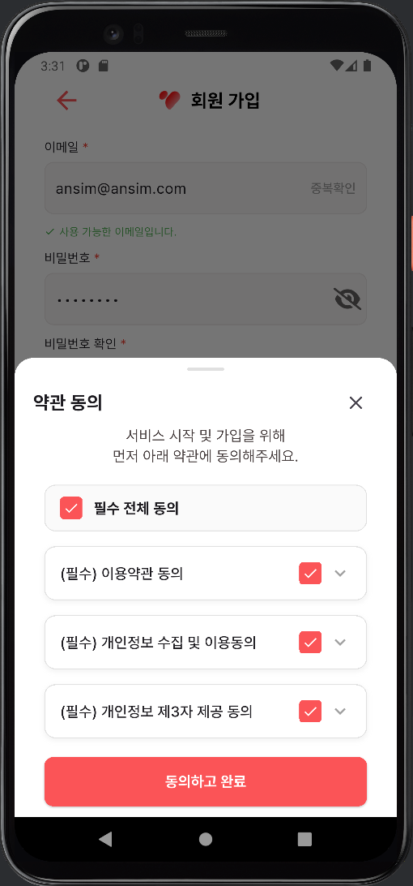
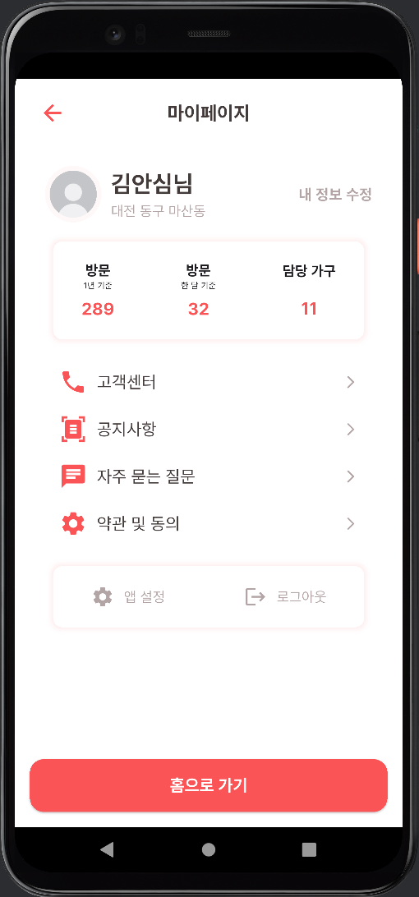
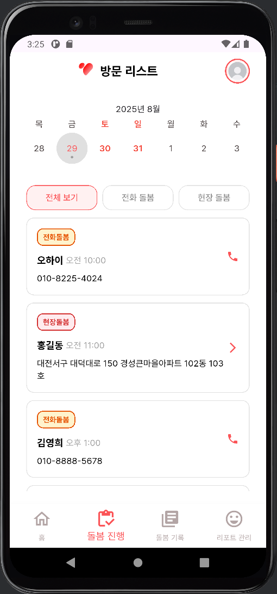
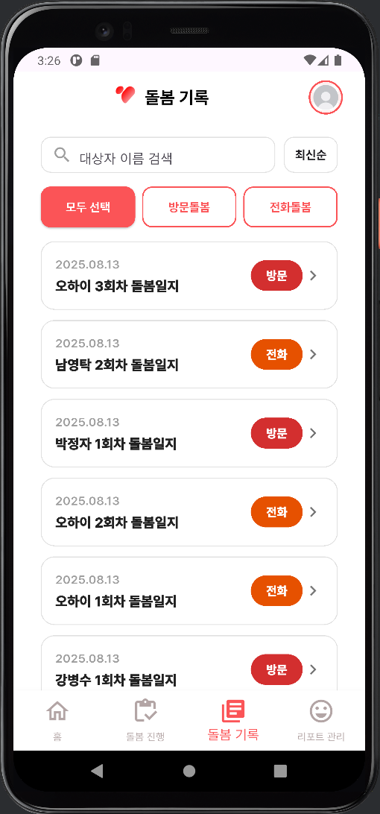
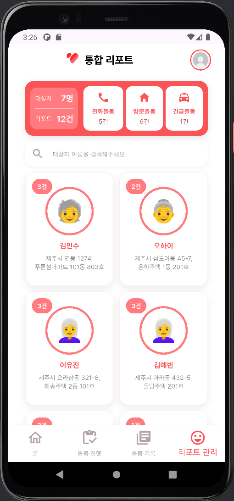

# AI-Care-Report-Fe

AI 기반 상담 데이터 요약 및 리포트 자동화 시스템의 **프론트엔드 리포지토리**입니다.
본 프로젝트는 2025 인턴형 프로젝트에서 진행하였으며, 돌봄 현장에서 수집되는 상담 데이터를 자동으로 요약·리포트화하여 **업무 효율성**과 **데이터 표준화**를 지원합니다.

---

## 📌 프로젝트 개요

* **프로젝트 주제**: AI 기반 상담 데이터 요약 및 리포트 자동화 시스템
* **수행 기간**: 2025.07.16 \~ 2025.08.29
* **역할**: 프론트엔드 개발 (Flutter)
* **백엔드 연동 성공 기능**: 로그인, 회원가입
* **주요 기능(UI)**

  * 홈(Home): 일정 및 미작성 리포트, 서비스 추천 확인
  * 로그인/회원가입: JWT 기반 인증, 자동 로그인
  * 방문(Visit): 대상자 목록, 상담 기록, 체크리스트
  * 리포트(Report): 단계별 리포트 작성 및 미리보기
  * 마이페이지(MyPage): 유저 정보 관리

---

## 🛠️ 기술 스택
- **Framework**: Flutter 3.32 (Dart)
- **State Management**: Provider
- **Architecture**: MVVM
- **Auth**: JWT 기반 인증
- **API**: RESTful API 연동
- **Tools**: VS Code, Android Emulator, Git/GitHub

## 💡 개인 기여도
- Provider를 활용한 상태관리 및 자동 로그인 구현
- 로그인/회원가입 API 연동 성공 (JWT 기반 인증 처리)
- 홈/리포트/방문/마이페이지 UI 설계 및 구현
- 공통 위젯(AppBar, Button, Card) 모듈화로 코드 재사용성 향상


## 📂 디렉토리 구조

본 프로젝트는 **MVVM 구조**에 기반하여 설계되었습니다.

```
lib/
├── main.dart                 # 앱 진입점
├── model/                    # 데이터 모델
├── provider/                 # 상태 관리 (Provider)
├── repository/               # Repository 계층 (API 통신)
├── service/                  # Service 계층 (로직 처리)
├── util/                     # 유틸리티 (토큰 저장, 네트워크 등)
├── view/                     # UI 화면 (home, login, mypage, visit, report 등)
├── view_model/               # ViewModel (상태 관리, 비즈니스 로직)
└── widget/                   # 공통 위젯 (AppBar, Button, Card 등)
```

---

## 🔑 주요 구현 사항

### ✅ 사용자 인증

* `/db/register` 회원가입, `/db/login` 로그인 (JWT 발급)
* `login_storage_helper.dart` 를 통한 토큰 저장 및 자동 로그인 처리

### ✅ 홈 화면

* 오늘 일정 및 미작성 리포트 카드 표시 (`recent_card.dart`)

### ✅ 방문(Visit) 기능

* `visit_list_page.dart`: 방문 대상자 목록

### ✅ 리포트 관리

* 단계별 리포트 페이지(`report_1_new.dart` \~ `report_5_new.dart`)

### ✅ 마이페이지

* 사용자 기본 정보 표시

---

## 🖼️ UI 시연 이미지

실제 개발 화면

| 홈 화면 | 로그인 | 회원가입 | 마이페이지 | 방문 진행 | 기록 관리 | 리포트 관리 |
|---------|--------|----------|------------|-----------|-----------|-------------|
|  |  |  |  |  |  |  |


---

## 🎥 시연 영상

[📺 Demo Video](https://www.youtube.com/watch?v=rGAkDS2AEVM)


---

## 🚀 실행 방법

```bash
# 패키지 설치
flutter pub get

# 디버그 실행
flutter run
```