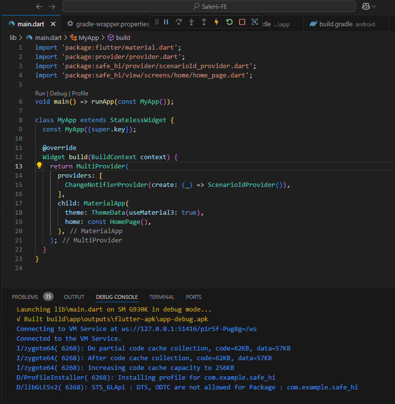

# SafeHi-FE

'안심하이' 프론트엔드 레포입니다 :)

## SafeHi-FE 프로젝트 설정 가이드

SafeHi 프로젝트를 로컬 환경에서 실행하기 위한 가이드입니다. 아래 과정을 순서대로 따라 주세요.

---

### **필수 소프트웨어**
1. **[Flutter SDK](https://docs.flutter.dev/get-started/install)** 설치  
   - 권장 버전: **3.13.6 이상**
2. **[Android Studio](https://developer.android.com/studio)** 설치 및 에뮬레이터 설정  
   - AVD Manager를 통해 가상 장치(Emulator)를 생성.
3. **[VS Code](https://code.visualstudio.com/)** 설치  
   - Flutter & Dart 확장 프로그램 설치 필요.

---

### **설치 및 실행 방법**

1. **프로젝트 클론**
   ```bash
   git clone https://github.com/SAFE-HI/SafeHi-FE.git
   cd SafeHi-FE
   ```
   클론 이후 flutter / dart 설치 이후에 아래와 같이하면 된다.

### flutter doctor 설치
   flutter doctor 친 후에 부족한 것들 설치하면됨

   ```
   flutter doctor --android-licenses
   ```

   이때 android studio 에서 Android SDK - SDK Tools 에서
   Android SDK Build-Tools / Android SDK Command-line Tools / Android SDK Platform-Tools 다운 받으면 됨

   https://www.androidhuman.com/2021-06-02-flutter_android_license_noclassdeffound

2. **의존성 설치**
   ```bash
    flutter pub get
   ```

3. **안드로이드 에뮬레이터 실행**
   - VS Code에서 화면 우측 하단의 장치 선택 메뉴에서 에뮬레이터 선택 후 실행

4. **프로젝트 실행**
   - VS Code에서 main.dart 파일을 열고 F5 키를 눌러 실행. (Start Debugging)


### (25.2) yujin fix - Kotlin 버전 불일치 문제 해결 및 Gradle 설정 업데이트

   ``` bash
   flutter upgrade
   rm -rf ~/.gradle/caches/ # window면 그냥 지우면됨
   flutter clean 
   flutter pub get
   ```

   이렇게되면 성공
   